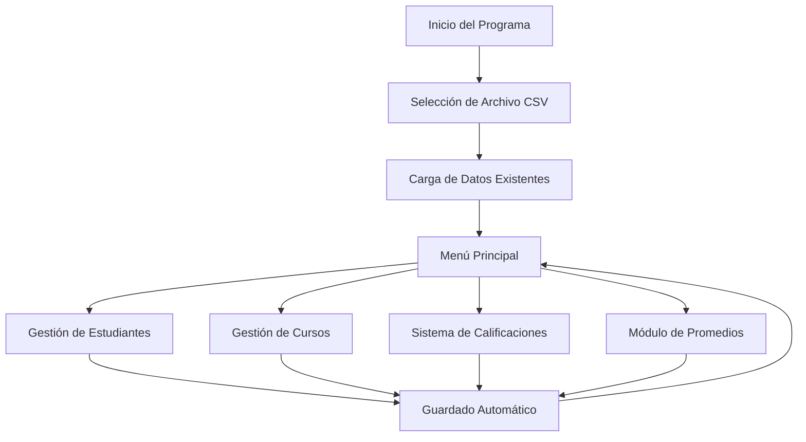

# 📚 Sistema de Gestión Académica - Tutorial Completo

## 📋 Tabla de Contenidos
1. [Introducción](#introducción)
2. [Instalación de g++ con Chocolatey](#instalación-de-g-con-chocolatey)
3. [Estructura del Proyecto](#estructura-del-proyecto)
4. [Funcionalidades Principales](#funcionalidades-principales)
5. [Arquitectura del Código](#arquitectura-del-código)
6. [Compilación y Ejecución](#compilación-y-ejecución)
7. [Uso del Sistema](#uso-del-sistema)
8. [Beneficios del Proyecto](#beneficios-del-proyecto)
9. [Troubleshooting](#troubleshooting)

---

## 🎯 Introducción

Este proyecto es un **Sistema de Gestión Académica** desarrollado en C++ que permite gestionar estudiantes, cursos y calificaciones de manera eficiente. El sistema está diseñado para ser utilizado por profesores o administradores académicos que necesitan:

- ✅ Gestionar información de estudiantes
- ✅ Administrar cursos/materias
- ✅ Registrar y calcular calificaciones
- ✅ Generar reportes en formato CSV
- ✅ Mantener persistencia de datos

### Características Principales
- **Interfaz de consola intuitiva** con navegación por teclado
- **Persistencia de datos** en archivos CSV
- **Cálculo automático de promedios** y estados de aprobación
- **Generación de reportes** para estudiantes y materias
- **Búsqueda y filtrado** en tiempo real
- **Validación de datos** integrada

---

## 🛠️ Instalación de g++ con Chocolatey

### ¿Qué es Chocolatey?
Chocolatey es un gestor de paquetes para Windows que facilita la instalación de herramientas de desarrollo, similar a `apt` en Ubuntu o `brew` en macOS.

### Paso 1: Instalar Chocolatey

1. **Abrir PowerShell como Administrador**
   - Presiona `Windows + X`
   - Selecciona "Windows PowerShell (Administrador)" o "Terminal (Administrador)"

2. **Ejecutar el comando de instalación**
   ```powershell
   Set-ExecutionPolicy Bypass -Scope Process -Force; [System.Net.ServicePointManager]::SecurityProtocol = [System.Net.ServicePointManager]::SecurityProtocol -bor 3072; iex ((New-Object System.Net.WebClient).DownloadString('https://community.chocolatey.org/install.ps1'))
   ```

3. **Verificar la instalación**
   ```powershell
   choco --version
   ```

### Paso 2: Instalar g++ (MinGW)

1. **Instalar MinGW con Chocolatey**
   ```powershell
   choco install mingw -y
   ```

2. **Verificar la instalación**
   ```powershell
   g++ --version
   ```

### Paso 3: Configurar Variables de Entorno (si es necesario)

Si `g++` no se reconoce después de la instalación:

1. **Buscar la ubicación de MinGW**
   ```powershell
   where g++
   ```

2. **Agregar al PATH del sistema**
   - Abrir "Variables de entorno" desde el Panel de Control
   - Editar la variable PATH
   - Agregar la ruta donde se instaló MinGW (generalmente `C:\ProgramData\chocolatey\lib\mingw\tools\install\mingw64\bin`)

### Alternativa: Instalación Manual de MinGW

Si prefieres no usar Chocolatey:

1. Descargar MinGW desde: https://www.mingw-w64.org/downloads/
2. Instalar siguiendo las instrucciones del instalador
3. Agregar `C:\mingw64\bin` al PATH del sistema

---

## 🏗️ Estructura del Proyecto

```
ProyectoFinal/
├── proyecto.cpp          # Archivo principal del sistema
├── a.exe                 # Ejecutable compilado
├── *.csv                 # Archivos de datos (estudiantes, cursos, calificaciones)
└── TUTORIAL.md           # Este archivo de documentación
```

### Archivos CSV Generados
- `promedios_[nombre]_[codigo].csv` - Reportes de estudiantes individuales
- `promedios_[materia].csv` - Reportes por materia
- `[nombre_archivo].csv` - Archivos de datos principales

---

## ⚙️ Funcionalidades Principales

### 1. **Gestión de Estudiantes**
- ✅ Crear nuevos estudiantes con nombre y código
- ✅ Editar información de estudiantes existentes
- ✅ Eliminar estudiantes del sistema
- ✅ Búsqueda en tiempo real por nombre

### 2. **Gestión de Cursos/Materias**
- ✅ Crear nuevas materias
- ✅ Editar nombres de materias existentes
- ✅ Eliminar materias del sistema
- ✅ Búsqueda en tiempo real por nombre

### 3. **Sistema de Calificaciones**
- ✅ Registro de 4 tipos de calificaciones por materia:
  - **Zona**: 0-30 puntos
  - **Parcial 1**: 0-15 puntos
  - **Parcial 2**: 0-15 puntos
  - **Examen**: 0-40 puntos
- ✅ Cálculo automático de nota total (máximo 100 puntos)
- ✅ Validación de rangos de calificaciones

### 4. **Módulo de Promedios**
- ✅ **Promedios por Estudiante**: Vista completa de todas las materias
- ✅ **Promedios por Materia**: Vista de todos los estudiantes en una materia
- ✅ Cálculo automático de estados (APROBADO/REPROBADO) con mínimo de 61 puntos
- ✅ Generación de reportes CSV detallados

### 5. **Persistencia de Datos**
- ✅ Guardado automático en archivos CSV
- ✅ Carga automática al iniciar el programa
- ✅ Múltiples archivos de datos soportados
- ✅ Validación de formato de archivos

---

## 🏛️ Arquitectura del Código

### Estructuras de Datos Principales

```cpp
struct Curso {
    string nombre;      // Nombre de la materia
    float zona;        // Calificación de zona (0-30)
    float parcial1;   // Primer parcial (0-15)
    float parcial2;   // Segundo parcial (0-15)
    float examen;     // Examen final (0-40)
};

struct Estudiante {
    string nombre;           // Nombre del estudiante
    string codigo;           // Código único del estudiante
    vector<Curso> cursos;    // Lista de cursos del estudiante
};
```

### Variables Globales
```cpp
vector<Estudiante> estudiantes;  // Base de datos de estudiantes
vector<string> cursos;           // Lista de materias disponibles
string carreraSeccion;           // Identificador de carrera/sección
string archivoSeleccionado;      // Archivo CSV activo
```

### Módulos del Sistema

#### 1. **Utilidades de Interfaz** (Líneas 42-140)
- `limpiarPantalla()`: Limpia la consola (compatible Windows/Linux)
- `padding()`: Centra texto en celdas de tabla
- `tablaDeTres()`: Muestra elementos en formato de tabla 3x3
- `topLinea()`, `bottomLinea()`, `middleLinea()`: Caracteres Unicode para tablas

#### 2. **Sistema de Navegación** (Líneas 143-201)
- `crearTexto()`: Captura entrada del usuario con callback en tiempo real
- `navegarMenu()`: Sistema de navegación con teclas W/S (arriba/abajo)
- `moverOpcion()`: Lógica de navegación circular en menús

#### 3. **Gestión de Archivos** (Líneas 204-375)
- `guardarDatos()`: Serializa datos a formato CSV personalizado
- `cargarDatos()`: Deserializa datos desde CSV
- `buscarArchivos()`: Encuentra archivos CSV en el directorio
- `archivoVacio()`: Valida si un archivo está vacío

#### 4. **Gestión de Cursos** (Líneas 381-555)
- `crearCurso()`: Añade nueva materia al sistema
- `editarCurso()`: Modifica nombre de materia existente
- `eliminarCurso()`: Elimina materia y sus datos asociados
- `filtrarCursos()`: Búsqueda parcial case-insensitive

#### 5. **Gestión de Estudiantes** (Líneas 559-728)
- `crearEstudiante()`: Registra nuevo estudiante
- `editarEstudiante()`: Modifica datos de estudiante
- `eliminarEstudiante()`: Elimina estudiante del sistema
- `filtrarEstudiantes()`: Búsqueda parcial case-insensitive

#### 6. **Sistema de Calificaciones** (Líneas 732-1014)
- `calcularNotaTotal()`: Suma zona + parcial1 + parcial2 + examen
- `mostrarTablaCalificaciones()`: Vista tabular de todas las calificaciones
- `menuEditarCalificaciones()`: Interfaz para modificar notas
- `encontrarIndiceCurso()` / `encontrarIndiceEstudiante()`: Búsqueda por nombre

#### 7. **Módulo de Promedios** (Líneas 1017-1431)
- `mostrarPromediosEstudiante()`: Vista completa de un estudiante
- `mostrarPromediosMateria()`: Vista de una materia específica
- `generarCSVEstudiante()`: Exporta reporte individual
- `generarCSVMateria()`: Exporta reporte por materia
- `estaAprobado()`: Determina estado de aprobación (≥61 puntos)

### Flujo de Datos



---

## 🔨 Compilación y Ejecución

### Compilación
```bash
g++ -o sistema_academico proyecto.cpp
```

### Ejecución
```bash
./sistema_academico.exe
```

### Compilación con Optimizaciones
```bash
g++ -O2 -Wall -o sistema_academico proyecto.cpp
```

### Compilación para Debug
```bash
g++ -g -Wall -o sistema_academico_debug proyecto.cpp
```

---

## 🎮 Uso del Sistema

### Inicio del Programa

1. **Selección de Archivo**
   - El programa muestra archivos CSV existentes
   - Puedes escribir para filtrar archivos
   - Presiona Enter para crear un nuevo archivo

2. **Configuración Inicial** (si es archivo nuevo)
   - Ingresa el nombre de la carrera/sección
   - El sistema crea la estructura básica del archivo

### Navegación en Menús

- **W/S**: Navegar hacia arriba/abajo
- **Enter**: Seleccionar opción
- **Backspace**: Borrar texto al escribir
- **Escape**: Salir (en algunos contextos)

### Flujo de Trabajo Recomendado

1. **Crear Cursos/Materias**
   - Ve a "Crear/eliminar cursos"
   - Escribe el nombre de la materia
   - Presiona Enter para crear

2. **Registrar Estudiantes**
   - Ve a "Crear/eliminar estudiantes"
   - Escribe nombre y código del estudiante
   - Presiona Enter para registrar

3. **Registrar Calificaciones**
   - Ve a "Calificaciones"
   - Selecciona la materia
   - Selecciona el estudiante
   - Ingresa las 4 calificaciones

4. **Generar Reportes**
   - Ve a "Promedios"
   - Selecciona "Por Estudiante" o "Por Materia"
   - El sistema genera automáticamente archivos CSV

---

## 💡 Beneficios del Proyecto

### 1. **Eficiencia Operativa**
- ✅ **Automatización completa** del cálculo de promedios
- ✅ **Interfaz intuitiva** que reduce errores de usuario
- ✅ **Búsqueda en tiempo real** para acceso rápido a datos
- ✅ **Validación automática** de rangos de calificaciones

### 2. **Persistencia y Confiabilidad**
- ✅ **Guardado automático** evita pérdida de datos
- ✅ **Múltiples archivos** permiten separar por grupos/clases
- ✅ **Formato CSV** facilita importación a Excel/Google Sheets
- ✅ **Validación de archivos** previene corrupción de datos

### 3. **Flexibilidad y Escalabilidad**
- ✅ **Número ilimitado** de estudiantes y materias
- ✅ **Sistema modular** fácil de extender
- ✅ **Búsqueda parcial** mejora la experiencia de usuario
- ✅ **Reportes personalizados** por estudiante o materia

### 4. **Transparencia Académica**
- ✅ **Cálculos transparentes** (zona + parciales + examen)
- ✅ **Estados claros** de aprobación/reprobación
- ✅ **Reportes detallados** para estudiantes y administración
- ✅ **Historial completo** de calificaciones

### 5. **Beneficios Técnicos**
- ✅ **Código bien estructurado** con separación de responsabilidades
- ✅ **Uso de STL** (Standard Template Library) para eficiencia
- ✅ **Manejo de archivos robusto** con validación de errores
- ✅ **Interfaz de consola** que funciona en cualquier sistema Windows

### 6. **Ventajas Educativas**
- ✅ **Demostración práctica** de programación orientada a objetos
- ✅ **Implementación de estructuras de datos** (vectores, strings)
- ✅ **Manejo de archivos** y persistencia de datos
- ✅ **Interfaz de usuario** en consola con caracteres Unicode

---

## 🔧 Troubleshooting

### Problemas Comunes

#### 1. **Error de Compilación: "g++ no se reconoce"**
```bash
# Solución: Verificar instalación de MinGW
where g++
# Si no aparece, reinstalar con Chocolatey
choco install mingw -y
```

#### 2. **Caracteres Unicode No Se Muestran Correctamente**
```cpp
// El programa ya incluye estas líneas en main():
SetConsoleOutputCP(CP_UTF8); 
SetConsoleCP(CP_UTF8);
```

#### 3. **Archivo CSV No Se Carga**
- Verificar que el archivo tenga el marcador "COMPATIBLE" en la primera línea
- Asegurar que el archivo no esté corrupto
- Verificar permisos de lectura del archivo

#### 4. **Error al Guardar Datos**
- Verificar permisos de escritura en el directorio
- Asegurar que el archivo no esté abierto en otro programa
- Verificar espacio en disco disponible

#### 5. **Navegación en Menús No Funciona**
- Asegurar que la consola esté en modo de entrada directa
- Verificar que las teclas W/S estén funcionando correctamente
- Reiniciar el programa si persiste el problema

### Comandos de Diagnóstico

```bash
# Verificar versión de g++
g++ --version

# Verificar archivos CSV en el directorio
dir *.csv

# Compilar con información de debug
g++ -g -Wall -o debug_version proyecto.cpp
```

---

## 📞 Soporte y Contribuciones

### Estructura del Equipo
- **Grupo 6, Sección C** - Universidad Mariano Gálvez
- Desarrollado como proyecto final de programación

### Mejoras Futuras Sugeridas
1. **Interfaz Gráfica**: Implementar GUI con Qt o similar
2. **Base de Datos**: Migrar a SQLite para mejor rendimiento
3. **Reportes PDF**: Generar reportes en formato PDF
4. **Backup Automático**: Sistema de respaldo automático
5. **Validación Avanzada**: Validación de códigos de estudiante únicos
6. **Estadísticas**: Gráficos y análisis estadísticos

---

## 📄 Licencia

Este proyecto es desarrollado con fines educativos para la Universidad Mariano Gálvez. El código está disponible para uso académico y de aprendizaje.

---

*Tutorial creado para el Sistema de Gestión Académica - Grupo 6, Sección C*
